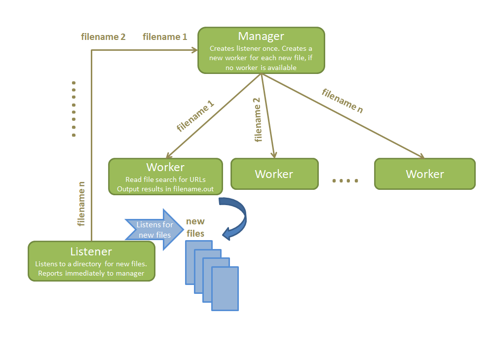

# System Programming - Processes
* Process creation using fork/exec 
* Process communication using pipes, named pipes, low level I/O and signal handling
* Bash scripting

## Development Environment

The code was tested in the Linux systems. More specifically, the software used was:
* Ubuntu 18.04.6 LTS
* gcc 7.5.0
* valgrind 3.13.0
* GNU Make 4.1

## Project Structure
The project contains the following directories:
* **objects**: is created when the program is compiled, contains all object (.o) files.
* **headers**: contains all header files (.h) that the project needs.
* **sources**: contains all source code (.c) of the modules.
* **files**: contains sample files for testing the program.


## What to install
You have to instal **inotify-tools** in order to run the program.

```
sudo apt update
sudo apt install inotify-tools
```

## Objective
The *inotifywait* command notifies for changes in files in a directory of the file system. This opeartion is handled by the **listener**. The listener informs the manager for any changes (creation of new file or moving of a file) in the specified directory. 

The **manager** communicates with both the listener and the workers. It communicates with the listener through pipe and with the workers through named pipes. After the manager has been informed for the changes, it creates the required amount of workers. The manager creates new workers if no workers are available. 

The **workers** are processing the files. Each worker process one file at a time. The worker opens the file and searches for URLs using low-level I/O. Every URL begins with *http://* and ends with a space character. The **files** directory contains sample files with text and URLs for testing the program.

Each **worker** must extract the location of the URL without *www*. For example, for the "http://www.google.com" the location is the "google.com". The worker creates a new file where it writes down every unique location with the number of appearances. The files created by the workers end in **".out"**

The process hierarchy can be seen in the scheme below:




## Bash scripting 

This is a bash script which takes 1 or more Top Level Domains (TLD) as arguments and it seeks for the total times these TLDs appear in all .out files. The .out files were created by the workers and are found in **OUT_FILES** directory.

For example if you give the TLD *com* as argument, the output will be the sum of the total number of appearances of the locations ending in *com*.

In the main directory of the project in order to run the **finder.sh** type:

```
chmod +x finder.sh
./finder.sh com org (etc)
```


## Compilation and Running

The project's directory contains a **Makefile** to be used for separate compilation. In order to **compile** the program, the user has to type this command to the terminal when they are at the main directory of the project :

```
make
```
This will delete any previous versions of the files and produce all object files and store them in a directory named "**objects**". Also, it will produce the executable file **sniffer** in the main directory.
You can specify the path to the directory, which you want to monitor giving the -p [path] command line argument. If no argument is given, then the main directory of the project is being monitored.

Then you can type:

```
./sniffer
or
./sniffer -p [path]
```

The program ends when the user types ^C and all processes are killed.

When you type:

```
make clean
```
the directories **OUT_FILES** containing all *.out* files and **Manager_Worker_FIFOS** are being deleted.